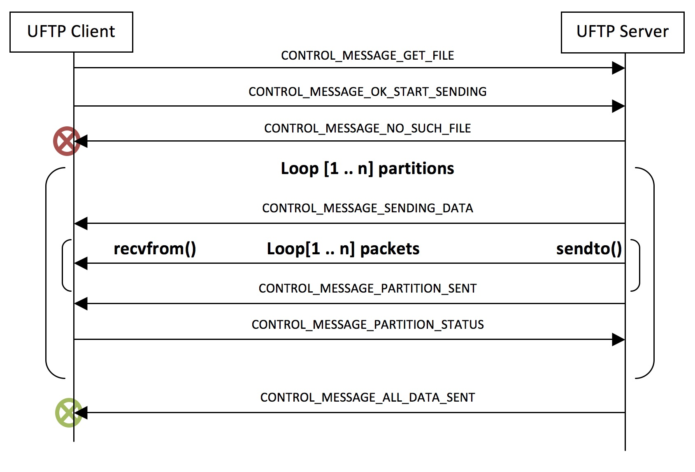

# UDP-based File Transport Protocol (UFTP)
## Version 0.8 - Copyright (C) 2007 Stephen Makonin.

UFTP is a modified version of FTP that used a TCP socket connection to pass control and command information, and a UDP socket to transfer data to/from the server and the client. 

## Data Partitioning and Packet Design

Each file is broken down into a number of partitions. Each partition is broken down into a maximum of 64 packets. Each packet is 1500 bytes in length, including an 8-byte header. The maximum data size of a partition is 95,488 bytes, and any one file can have a maximum of 65,535 partitions; this means that a data file can be no larger than 6.25 GB.

The current partition must be received in its entirety before the next partition is sent. The client only makes retransmit request after all packets in a partition are sent. Retransmitted are requested due to missing or corrupt packets. Each transmit request is submitted as a 64-bit integer (1 bit per packet).

## Synchronization and Program Flow

Synchronization is done through a series of control messages between the UFTP client and the server while data is being transferred. The control messages are:

* ```CONTROL_MESSAGE_GET_FILE``` Client tells the server what file it wants.
* ```CONTROL_MESSAGE_OK_START_SENDING``` Client tells the server its UPD is setup and is ready to receive data.

* ```CONTROL_MESSAGE_SENDING_DATA``` Server tells the client is beginning to send the partition packets.

* ```CONTROL_MESSAGE_PARTITION_SENT``` Server tells the client all the partition packets are sent.

* ```CONTROL_MESSAGE_PARTITION_STATUS``` Client tells server which packets were received and which were not.

* ```CONTROL_MESSAGE_ALL_DATA_SENT``` Server tells the client all partition are sent, i.e. the file is sent.

* ```CONTROL_MESSAGE_NO_SUCH_FILE``` Server tells the client the file requested does not exist.

Here is a basic scenario of a data file transfer via UFTP:




## Limitations and Future Improvements

Testing is only done on a LAN and a fixed congestion control rate of 6 milliseconds will be implemented (after various tests). The purpose of this version is to focus on reliable transfer, meaning all packets get received from the server to the client. As well, this version will only allow downloads from the server no uploading to the server will be implemented at this time. 

Improvements that could be done for future version will be dynamic/adaptive congestion control. As well, a conversation to non-blocking sockets to improve performance and flexibility for WAN transfers.

